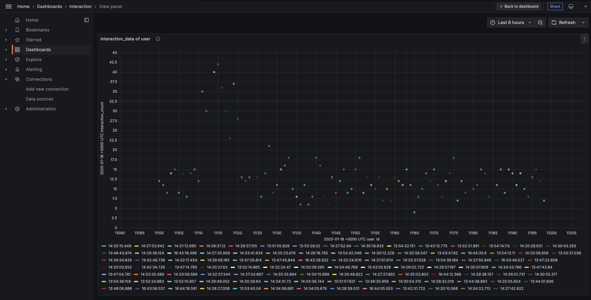
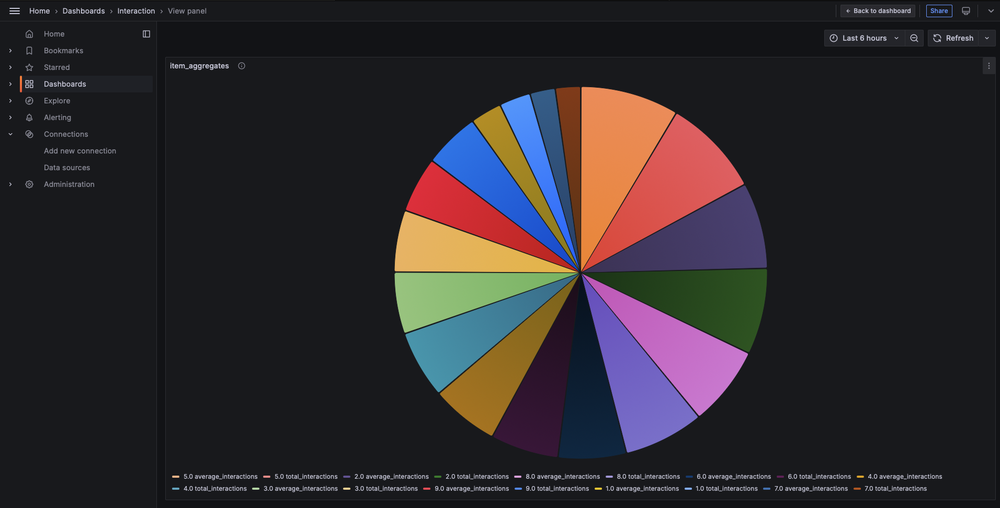
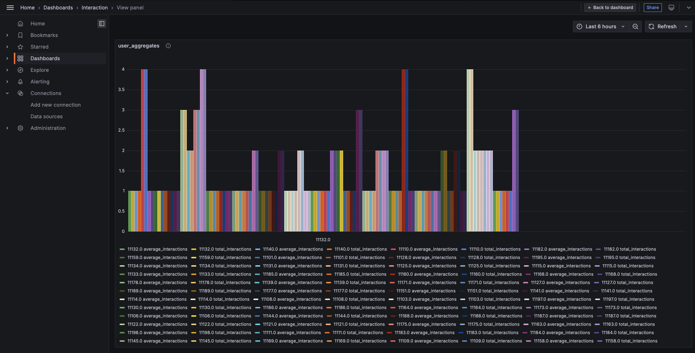

# Integration of Docker, Kafka, Cassandra, MongoDB, PySpark, and Grafana

This repository provides a `docker-compose.yml` configuration to set up a multi-container environment for Kafka, Cassandra, MongoDB, PySpark, and Grafana. The setup is designed to provide a simple architecture to simulate message production, processing, and storage with monitoring capabilities.

### Version

```yaml
version: '3'
```

### Services

The following services are included in this Docker Compose setup:

1. **Zookeeper**: A service for managing distributed applications and providing synchronization in Kafka.

2. **Kafka Broker**: The main Kafka service, which is used for producing and consuming messages.

3. **Producer**: A Kafka producer service that produces messages to Kafka topics.

4. **PySpark Consumer**: A consumer service that processes Kafka messages using PySpark, stores them in Cassandra, and can use MongoDB for other purposes.

5. **Cassandra**: A highly available NoSQL database for storing interaction data.

6. **Grafana**: A data visualization platform that connects to Cassandra to visualize the stored data.

7. **MongoDB**: A NoSQL database to store other application data.

---

### Prerequisites

Before you start using this Docker Compose setup, ensure you have the following installed:

- **Docker**: Ensure that Docker is installed and running on your machine.
- **Docker Compose**: Ensure Docker Compose is installed on your machine.

---

### Getting Started

#### 1. Clone the Repository

Clone this repository to your local machine.

```bash
git clone https://github.com/your/repository.git
cd repository
```

#### 2. Update the Application Code (Optional)

If you want to modify the producer or consumer code, you can navigate to `./src/producer` and `./src/pyspark_consumer` directories to adjust the code.

#### 3. Build and Start the Services

From the root directory of the repository, run the following command to start the services:

```bash
docker-compose up --build
```

This will:

- Build the producer and PySpark consumer images from the `Dockerfile`s located in `./src/producer` and `./src/pyspark_consumer`.
- Start all services, including Kafka, Zookeeper, Cassandra, MongoDB, Grafana, and the producer and consumer services.

#### 4. Access the Services

- **Kafka Broker**: Accessible at `localhost:9092` for message production and consumption.
- **Grafana**: Access Grafana's dashboard at `http://localhost:3000`. Default credentials are `admin/admin`.
- **MongoDB**: Accessible at `localhost:27017`.
- **Cassandra**: Accessible at `localhost:9042` for CQL queries.

---

### Service Breakdown

#### Zookeeper

- **Image**: `confluentinc/cp-zookeeper:7.0.1`
- **Ports**: Exposes `2181` for client connections.
- **Environment Variables**:
  - `ZOOKEEPER_CLIENT_PORT`: Port for client connections.
  - `ZOOKEEPER_TICK_TIME`: Zookeeper tick time.

#### Kafka Broker

- **Image**: `confluentinc/cp-kafka:7.0.1`
- **Ports**: Exposes `9092` to the host for Kafka connections.
- **Environment Variables**:
  - `KAFKA_BROKER_ID`: Broker ID for Kafka.
  - `KAFKA_ZOOKEEPER_CONNECT`: Zookeeper connection string.
  - `KAFKA_LISTENER_SECURITY_PROTOCOL_MAP`: Kafka security protocol map.
  - `KAFKA_ADVERTISED_LISTENERS`: Advertised listeners for the broker.
  - `KAFKA_OFFSETS_TOPIC_REPLICATION_FACTOR`: Replication factor for offset topics.

#### Producer

- **Build Context**: `./src/producer`
- **Ports**: None exposed (internal communication with Kafka).
- **Environment Variables**:
  - `KAFKA_BOOTSTRAP_SERVERS`: Bootstrap server URL for Kafka.
  - `INPUT_TOPIC`: Topic to which the producer sends messages.

#### PySpark Consumer

- **Build Context**: `./src/pyspark_consumer`
- **Ports**: None exposed (internal communication with Kafka, Cassandra, and MongoDB).
- **Environment Variables**:
  - `KAFKA_BOOTSTRAP_SERVERS`: Bootstrap server URL for Kafka.
  - `INPUT_TOPIC`: Kafka topic to consume from.
  - `CASSANDRA_HOST`: Host for Cassandra.
  - `CASSANDRA_KEYSPACE`: Cassandra keyspace.
  - `CASSANDRA_TABLE`: Cassandra table for storing data.

#### Cassandra

- **Image**: `cassandra:latest`
- **Ports**: Exposes `9042` for CQL (Cassandra Query Language) connections.
- **Environment Variables**:
  - `CASSANDRA_CLUSTER_NAME`: The name of the Cassandra cluster.
  - `CASSANDRA_DC`: The data center for the cluster.
  - `CASSANDRA_RACK`: The rack in the data center.
  - `CASSANDRA_LISTEN_ADDRESS`: The address used by Cassandra to communicate with other nodes.
- **Volumes**: 
  - `cassandra_data`: Persistent data storage for Cassandra.
  - `./cassandra/init`: Directory containing Cassandra initialization scripts.

#### Grafana

- **Image**: `grafana/grafana:latest`
- **Ports**: Exposes `3000` for accessing the Grafana UI.
- **Environment Variables**:
  - `GF_SECURITY_ADMIN_PASSWORD`: Password for Grafana's admin user.
- **Depends On**: Cassandra (used for visualizing Cassandra data).

#### MongoDB

- **Image**: `mongo:latest`
- **Ports**: Exposes `27017` for MongoDB connections.
- **Environment Variables**:
  - `MONGO_INITDB_ROOT_USERNAME`: MongoDB root username.
  - `MONGO_INITDB_ROOT_PASSWORD`: MongoDB root password.
- **Volumes**:
  - `mongo_data`: Persistent data storage for MongoDB.

---

### Volumes

This setup defines persistent volumes for MongoDB, Cassandra, and Grafana:

- **mongo_data**: Stores MongoDB data.
- **cassandra_data**: Stores Cassandra data.
- **grafana_data**: Stores Grafana data.

---

### Networks

This setup defines a custom network for communication between containers:

- **kafka-network**: A `bridge` network for all the services to communicate.

---

### Stopping the Services

To stop the services, run the following command:

```bash
docker-compose down
```

This will stop all containers and remove them, but the data volumes will persist.

---

### Additional Notes

- **Producer and Consumer**: The producer generates messages that are sent to the Kafka broker, while the PySpark consumer processes those messages and stores the results in Cassandra. 
- **Grafana**: You can create dashboards in Grafana to visualize the data from Cassandra.

---

### Troubleshooting

If you encounter any issues, consider the following:

- Ensure all containers are up and running with `docker-compose ps`.
- Check the logs for any errors with `docker-compose logs <service-name>`.
- Ensure Kafka and Cassandra are configured correctly if the producer or consumer are not working as expected.

--- 

For further assistance or contributions, feel free to open an issue or submit a pull request.


### Grafana

#### Dashboard Configuration [config.json](grapfana_dashbord/Interaction-1737221935123.json).

#### xychart for interaction data of user

- 


#### piechart for item_aggregates

- 


#### barchart fro user_aggregates

- 


